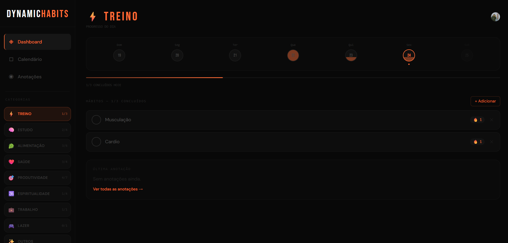

# 🔥 Dynamic Habits

> Rastreador de hábitos diários com banco de dados em nuvem, autenticação e visualização de progresso.


---

## 📷 Imagem



---

## 📋 Sobre o Projeto

**Dynamic Habits** é um app web para rastreamento de hábitos diários com foco em produtividade pessoal. Cada hábito é organizado por categoria, marcado diariamente e registrado em banco de dados na nuvem — acessível de qualquer dispositivo.

### Funcionalidades

- ✅ **Hábitos diários** — crie, marque como concluído e acompanhe streaks
- 📅 **Calendário de progresso** — visualize seu histórico mensal por categoria
- 📝 **Anotações** — registre observações por categoria e data
- 🗂️ **6 categorias** — Treino, Estudo, Alimentação, Saúde, Produtividade e Outros
- 🔐 **Autenticação** — login com Google ou email/senha
- ☁️ **Dados em nuvem** — sincronizado em tempo real via Supabase
- 📱 **Responsivo** — funciona no mobile com menu drawer e no desktop com sidebar fixa
- 🌙 **Tema dark** — interface escura com cores neon por categoria

---

## 🖥️ Preview

| Dashboard | Calendário | Anotações |
|-----------|-----------|-----------|
| Lista de hábitos pendentes do dia com streak e progresso semanal | Histórico mensal com intensidade de cor por conclusão | Notas por categoria com data |

---

## 🛠️ Stack

| Tecnologia | Versão | Uso |
|---|---|---|
| [React](https://react.dev) | 19 | Interface |
| [Vite](https://vitejs.dev) | 8 | Build e dev server |
| [Tailwind CSS](https://tailwindcss.com) | 4 | Estilização |
| [React Router](https://reactrouter.com) | 7 | Navegação |
| [Supabase](https://supabase.com) | - | Banco de dados + Auth |
| [Vercel](https://vercel.com) | - | Deploy |

---

## 📁 Estrutura do Projeto

```
src/
├── components/
│   ├── HabitCard.jsx       # Card de cada hábito com toggle e streak
│   ├── NoteCard.jsx        # Card de anotação
│   ├── ProgressBar.jsx     # Barra de progresso do dia
│   ├── Sidebar.jsx         # Menu lateral com categorias e navegação
│   └── WeekStrip.jsx       # Faixa com os 7 dias da semana
├── context/
│   └── AppContext.jsx      # Contexto global (activeTopic + dados)
├── data/
│   └── topics.js           # Constantes das categorias, dias e meses
├── hooks/
│   └── useHabits.js        # Hook com todas as operações do Supabase
├── lib/
│   └── supabase.js         # Instância do cliente Supabase
├── pages/
│   ├── Calendar.jsx        # Página do calendário mensal
│   ├── Dashboard.jsx       # Página principal com hábitos do dia
│   ├── Login.jsx           # Página de autenticação
│   └── Notes.jsx           # Página de anotações
├── App.jsx                 # Raiz — controla sessão e rotas
├── main.jsx                # Entry point
└── index.css               # Estilos globais + Tailwind
```

---

## 🗄️ Banco de Dados

### Tabelas no Supabase

```sql
-- Hábitos do usuário
habits (
  id          uuid PRIMARY KEY,
  user_id     uuid REFERENCES auth.users,
  topic       text,       -- ex: 'treino', 'estudo'
  name        text,
  streak      int,
  created_at  timestamptz
)

-- Registro de conclusões diárias
habit_completions (
  id        uuid PRIMARY KEY,
  habit_id  uuid REFERENCES habits,
  user_id   uuid REFERENCES auth.users,
  date      date,
  UNIQUE(habit_id, date)  -- impede duplicata
)

-- Anotações por categoria
notes (
  id         uuid PRIMARY KEY,
  user_id    uuid REFERENCES auth.users,
  topic      text,
  text       text,
  date       date,
  created_at timestamptz
)
```

Todas as tabelas usam **Row Level Security (RLS)** — cada usuário acessa somente seus próprios dados.

---

## 🚀 Rodando Localmente

### Pré-requisitos

- Node.js 18+
- Git
- Conta no [Supabase](https://supabase.com)

### 1. Clone o repositório

```bash
git clone https://github.com/Douglasl10/Dynamic-Habits.git
cd Dynamic-Habits
```

### 2. Instale as dependências

```bash
npm install
```

### 3. Configure as variáveis de ambiente

Crie um arquivo `.env` na raiz do projeto:

```env
VITE_SUPABASE_URL=https://seu-project-ref.supabase.co
VITE_SUPABASE_ANON_KEY=eyJhbGciOiJIUzI1NiIsInR5cCI6IkpXVCJ9...
```

> As chaves estão em **Supabase → Settings → API**

### 4. Configure o banco de dados

No **Supabase → SQL Editor**, execute o script completo:

```sql
-- Tabela de hábitos
create table habits (
  id         uuid primary key default gen_random_uuid(),
  user_id    uuid references auth.users(id) on delete cascade not null,
  topic      text not null,
  name       text not null,
  streak     int  not null default 0,
  created_at timestamptz default now()
);

-- Tabela de conclusões
create table habit_completions (
  id       uuid primary key default gen_random_uuid(),
  habit_id uuid references habits(id) on delete cascade not null,
  user_id  uuid references auth.users(id) on delete cascade not null,
  date     date not null,
  unique(habit_id, date)
);

-- Tabela de anotações
create table notes (
  id         uuid primary key default gen_random_uuid(),
  user_id    uuid references auth.users(id) on delete cascade not null,
  topic      text not null,
  text       text not null,
  date       date not null default current_date,
  created_at timestamptz default now()
);

-- Ativar RLS
alter table habits            enable row level security;
alter table habit_completions enable row level security;
alter table notes             enable row level security;

-- Políticas de acesso
create policy "ver habits"      on habits            for select using (auth.uid() = user_id);
create policy "criar habits"    on habits            for insert with check (auth.uid() = user_id);
create policy "atualizar habits" on habits           for update using (auth.uid() = user_id);
create policy "deletar habits"  on habits            for delete using (auth.uid() = user_id);

create policy "ver completions"    on habit_completions for select using (auth.uid() = user_id);
create policy "criar completions"  on habit_completions for insert with check (auth.uid() = user_id);
create policy "deletar completions" on habit_completions for delete using (auth.uid() = user_id);

create policy "ver notes"    on notes for select using (auth.uid() = user_id);
create policy "criar notes"  on notes for insert with check (auth.uid() = user_id);
create policy "deletar notes" on notes for delete using (auth.uid() = user_id);
```

### 5. Inicie o servidor

```bash
npm run dev
```

Acesse `http://localhost:5173`

---

## 🌐 Deploy na Vercel

### 1. Adicione as variáveis de ambiente

No painel da Vercel vá em **Settings → Environment Variables**:

```
VITE_SUPABASE_URL      → https://seu-project.supabase.co
VITE_SUPABASE_ANON_KEY → eyJhbGci...
```

### 2. Configure as URLs no Supabase

Em **Authentication → URL Configuration**:

```
Site URL:      https://seu-app.vercel.app
Redirect URLs: https://seu-app.vercel.app/**
```

### 3. Deploy automático

Qualquer `git push` na branch `main` faz deploy automático na Vercel.

---

## ➕ Adicionando Novas Categorias

Edite `src/data/topics.js` e adicione um novo objeto na lista:

```js
export const TOPICS = [
  // ...categorias existentes
  {
    id:    'espiritualidade',   // único, sem espaços ou acentos
    label: 'ESPIRITUALIDADE',  // nome exibido
    icon:  '🧘',               // emoji
    color: '#A8EDEA',          // cor hex exclusiva
  },
]
```

Não precisa alterar o banco — o `topic` é salvo como texto simples.

---

## 🔄 Fluxo dos Hábitos

```
Criar hábito → aparece na lista diária
      ↓
Marcar como concluído → some da lista + salva no banco
      ↓
Calendário registra o dia com progresso
      ↓
Meia-noite → novo dia, hábito volta na lista limpo
      ↓
Todos concluídos → tela de celebração 🎉
```

---

## 📄 Licença

MIT © [Douglas](https://github.com/Douglasl10)